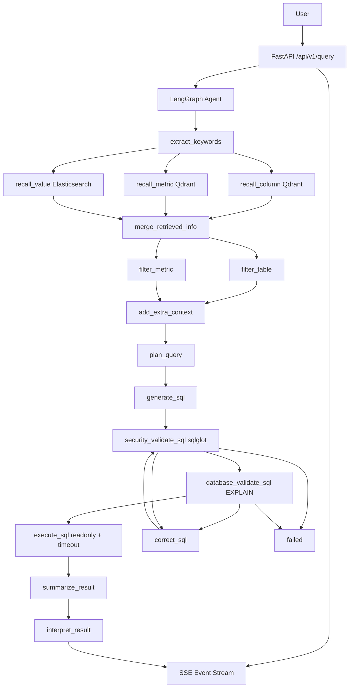

# wenshu-agent

`wenshu-agent` 是一个基于 FastAPI、LangGraph、LangChain、MySQL、Qdrant、Elasticsearch 和 HuggingFace Embedding 的自然语言转 SQL 数据分析 Agent。项目重点不是只演示 prompt 生成 SQL，而是展示一个面试级后端 Agent 项目应具备的工程能力：SQL 安全网关、结构化 Agent 流程、自动修正与重验、SSE 流式事件、异常脱敏、健康检查、测试和静态检查。

## 业务背景

用户输入自然语言问题，例如“统计去年各地区的销售总额”。系统会召回数据表字段、指标和字段取值，生成结构化查询计划，再生成 SQL、进行 SQL AST 安全校验、数据库语法验证、只读执行，最后把结果解释成自然语言。

## 核心功能

- 自然语言问题理解和关键词抽取
- 元数据 / 指标 / 字段取值混合召回
- LangGraph 编排 Agent 节点
- 结构化 QueryPlan
- SQL 生成、修正、重新验证
- SQL AST 只读安全网关
- 自动补 LIMIT 和最大行数限制
- 查询超时保护
- SSE 标准事件输出
- request_id 链路追踪
- 统一异常脱敏
- 健康检查接口
- pytest / ruff / mypy 核心检查

## 技术栈

- FastAPI
- LangGraph
- LangChain
- MySQL / SQLAlchemy / asyncmy
- Qdrant
- Elasticsearch
- HuggingFace text-embeddings-inference
- sqlglot
- pytest / ruff / mypy
- uv

## 架构图



## LangGraph 执行流程

```text
START
→ extract_keywords
→ recall_column / recall_value / recall_metric 并行
→ merge_retrieved_info
→ filter_table / filter_metric
→ add_extra_context
→ plan_query
→ generate_sql
→ security_validate_sql
→ database_validate_sql
→ execute_sql
→ summarize_result
→ interpret_result
→ END
```

校验失败时：

```text
security_validate_sql 或 database_validate_sql 失败
→ retry_count < max_retries 时进入 correct_sql
→ correct_sql 后重新进入 security_validate_sql
→ 再进入 database_validate_sql
→ 超过 max_retries 进入 failed
```

## SQL 安全设计

安全边界在代码层，不依赖 prompt。

`app/security/sql_security.py` 使用 `sqlglot` 解析 SQL AST，执行以下规则：

- 只允许单条 SQL
- 只允许 `SELECT` 或 `WITH ... SELECT`
- 拒绝 INSERT / UPDATE / DELETE / DROP / ALTER / CREATE / TRUNCATE / REPLACE / GRANT / REVOKE / CALL / LOAD DATA
- 拒绝 `INTO OUTFILE`
- 拒绝多语句
- 拒绝访问未授权表
- 拒绝访问系统库和系统表
- 提取 SQL 实际引用表
- 自动补充 LIMIT

生产环境还必须使用只读数据库账号。Prompt 不是安全边界，只读账号、AST 校验和最小权限需要同时存在。

## RAG 召回设计

项目不是传统文档 chunk RAG，而是数据分析元数据 RAG：

- `conf/meta_config.yaml` 定义表、字段、指标、别名和同步字段
- 构建脚本把字段和指标写入 Qdrant
- 字段取值写入 Elasticsearch
- 查询时并行召回字段、指标、字段取值
- 合并召回结果后进入 QueryPlan 和 SQL 生成 prompt

## SSE 事件设计

接口返回 `text/event-stream`，事件格式：

```text
event: stage
data: {"request_id":"...","event":"stage","sequence":2,"message":"Generating SQL"}
```

支持事件类型：

- started
- stage
- sql_generated
- sql_validated
- sql_corrected
- result
- error
- done

每个事件包含：

- request_id
- event
- node
- status
- message
- sequence
- elapsed_ms
- data

正常结束发送 `done`。异常时发送 `error` 和 `done`，不会把数据库原始异常或连接信息暴露给前端。

## 目录结构

```text
app/
  agent/              LangGraph、state、nodes
  api/                routers、schemas、dependencies
  clients/            MySQL、Qdrant、ES、Embedding client managers
  config/             OmegaConf 配置模型和加载
  core/               request_id、logging、exceptions、events、lifespan
  models/             MySQL / Qdrant / ES 数据模型
  repository/         数据访问层
  security/           SQL AST 安全网关
  service/            QueryService SSE 编排
conf/
  app_config.example.yaml
  meta_config.yaml
prompts/
  LLM prompt 模板
tests/
  unit/
  integration/
docker/
  mysql / qdrant / elasticsearch / embedding 依赖服务
```

## 本地启动

```powershell
cd D:\sgg-zhanggui-agent\code\data-agent
uv sync
Copy-Item conf\app_config.example.yaml conf\app_config.yaml
```

编辑 `conf/app_config.yaml`，填写自己的 API Key，并使用只读 DW 数据库账号：

```yaml
llm:
  api_key: your_siliconflow_api_key_here

db_dw:
  user: ghy_readonly
```

启动依赖服务：

```powershell
cd docker
docker compose up -d
```

构建元数据知识库：

```powershell
cd ..
uv run python -m app.scripts.build_meta_knowledge -c conf\meta_config.yaml
```

启动后端：

```powershell
uv run fastapi dev main.py
```

备用端口：

```powershell
uv run uvicorn main:app --reload --host 127.0.0.1 --port 8001
```

## API 示例

```http
POST /api/v1/query
Content-Type: application/json
X-Request-ID: demo-001

{
  "query": "统计去年各地区的销售总额",
  "max_rows": 100
}
```

旧接口 `/api/query` 保留为兼容接口，但推荐使用 `/api/v1/query`。

## 健康检查

```http
GET /health/live
GET /health/ready
```

`ready` 会检查 MySQL、Qdrant、Elasticsearch 和 Embedding 服务，使用短超时，避免长时间阻塞。

## 测试和静态检查

```powershell
uv run python -m compileall -q app tests
uv run pytest -q
uv run ruff check .
uv run mypy app/security app/core/events.py app/core/exceptions.py app/agent/state.py
```

当前全量历史 ORM / TypedDict 代码仍有类型债，因此 mypy 先覆盖本次新增的核心安全、事件、异常和状态模块。

## 面试亮点

1. Prompt 不作为安全边界，SQL 安全由 sqlglot AST 网关实现。
2. SQL 修正后必须重新经过安全校验和数据库校验。
3. retry_count / max_retries 防止无限修正循环。
4. 自动 LIMIT、最大返回行数和查询超时保护数据库资源。
5. 使用只读数据库账号作为生产环境底线。
6. LangGraph 节点职责清晰，召回、规划、生成、校验、执行、解释分层。
7. SSE 标准事件可展示 Agent 执行阶段，便于前端和调试。
8. request_id、日志脱敏、统一异常让系统具备可观测和安全的工程能力。

## 后续规划

- 把 LLM 调用进一步改为 provider 抽象，支持 fake model 注入
- 引入更严格的 SQL cost estimation
- 扩展 conversation_id 多轮上下文
- 对 ready 检查做分级熔断和缓存
- 将全量 ORM 和 repository 类型债纳入 mypy
