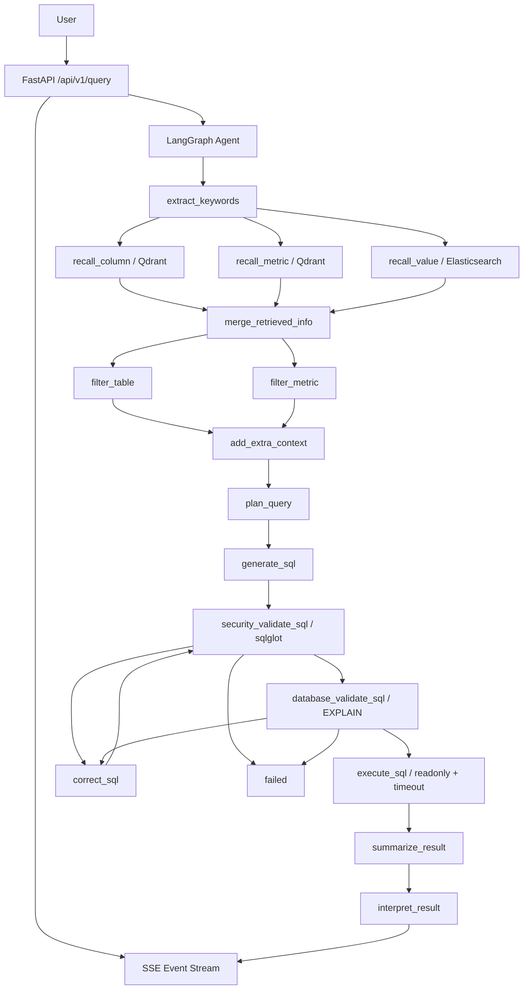

# wenshu-agent

`wenshu-agent` is a FastAPI + LangGraph text-to-SQL data analysis agent. It receives a business question, recalls metadata, builds a query plan, generates and validates SQL, executes a readonly query, and streams a concise answer back to the caller.

## Core Flow



## Directory Layout

```text
app/
  agent/              LangGraph graph, state, nodes, and LLM initialization
  api/                FastAPI routers, request schemas, and dependencies
  clients/            MySQL, Qdrant, Elasticsearch, and Embedding client managers
  config/             Runtime configuration dataclasses and loader
  core/               request_id, logging, exceptions, events, lifespan
  models/             MySQL / Qdrant / ES data models
  repository/         Data access layer
  security/           SQL security gateway and data masking
  service/            QueryService and SSE orchestration
conf/
  app_config.example.yaml
  meta_config.yaml
prompts/
  LLM prompt templates
tests/
  unit/
  integration/
```

## SQL Security

Security is enforced in code, not by prompt instructions. `app/security/sql_security.py` parses SQL with `sqlglot` and applies these rules:

- Only one statement is allowed.
- Only `SELECT` or `WITH ... SELECT` is allowed.
- INSERT, UPDATE, DELETE, DDL, CALL, LOAD DATA, HANDLER, PREPARE, EXECUTE, and file export capabilities are rejected.
- Dangerous functions are rejected: `sleep`, `benchmark`, `get_lock`, `release_lock`, `is_free_lock`, `is_used_lock`, `load_file`, `master_pos_wait`, `uuid_short`.
- Table and column allowlists are built from recalled `table_infos`.
- `SELECT *` and `table.*` are rejected by default.
- Unqualified columns are accepted for a single matching table and rejected when ambiguous across multiple tables.
- The outer LIMIT is enforced: missing LIMIT is added, oversized LIMIT is capped, and non-literal or negative LIMIT is rejected.
- Production deployments must use a readonly DW database account, never root.

## Query Execution And Result Exposure

`app/repository/mysql/dw_mysql_repository.py` sets MySQL execution timeout and readonly transaction mode on a best-effort basis, then fetches at most `max_rows + 1` records to detect truncation without unbounded `fetchall`.

SSE responses do not expose full SQL or raw database rows by default:

- `execute_sql` emits only `row_count`, `truncated`, `execution_time_ms`, and `referenced_tables`.
- `summarize_result` creates `row_count`, `columns`, `numeric_stats`, `sample`, and `truncated`.
- Result samples are masked by `app/security/data_masking.py`.
- The final event contains `final_answer` and `result_summary` by default.
- `expose_sql_to_client` and `expose_raw_rows_to_client` must be enabled explicitly for debugging. Raw rows are still sampled, masked, and limited by `max_sse_payload_bytes`.

## Streaming And Cancellation

The query API returns `text/event-stream`. `QueryService` consumes LangGraph with `astream(..., stream_mode="custom")`, wraps node custom events as SSE, and watches for client disconnects.

When a client disconnects, the graph task is cancelled and the async generator is closed. Disconnect cancellation does not emit `error` or `done` after the client is gone. Internal `CancelledError` keeps cancellation semantics and is not wrapped as a normal sanitized error.

## Local Setup

```powershell
cd D:\sgg-zhanggui-agent\code\data-agent
uv sync
Copy-Item confpp_config.example.yaml confpp_config.yaml
```

Edit `conf/app_config.yaml` with your LLM API key and a readonly DW database user:

```yaml
llm:
  api_key: your_api_key_here

db_dw:
  user: ghy_readonly
```

Start dependencies:

```powershell
cd docker
docker compose up -d
```

Build metadata knowledge:

```powershell
cd ..
uv run python -m app.scripts.build_meta_knowledge -c conf\meta_config.yaml
```

Start backend:

```powershell
uv run fastapi dev main.py
```

Alternative port:

```powershell
uv run uvicorn main:app --reload --host 127.0.0.1 --port 8001
```

## API Example

```http
POST /api/v1/query
Content-Type: application/json
X-Request-ID: demo-001

{
  "query": "count sales amount by region last year",
  "max_rows": 100
}
```

The legacy endpoint `/api/query` is kept for compatibility. Prefer `/api/v1/query`.

## Health Checks

```http
GET /health/live
GET /health/ready
```

`/health/ready` checks MySQL, Qdrant, Elasticsearch, and Embedding with short timeouts.

## Checks

```powershell
uv run pytest -q
uv run ruff check .
uv run ruff format --check .
uv run mypy app/security app/agent app/service app/api
```

Current tests cover SQL security, LIMIT enforcement, table and column allowlists, banned functions, data masking, result summaries, LangGraph routing, SSE events, API validation, request IDs, exception sanitization, and disconnect cancellation.

## Current Limits

- Column allowlists depend on recalled `table_infos`; missing metadata can reject otherwise valid SQL.
- MySQL timeout and readonly transaction setup are best effort and depend on database version and permissions. A readonly DB account is still required as the final permission boundary.
- `/health/ready` depends on external services and returns `degraded` when local dependencies are not running.
