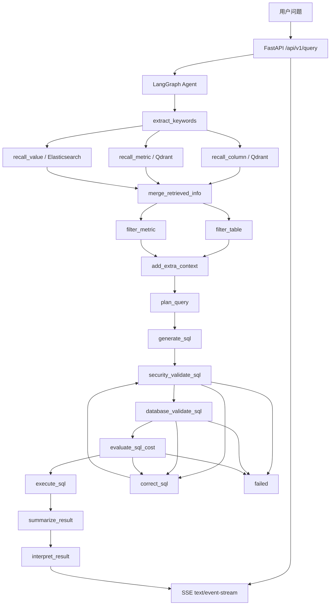

# wenshu-agent


`wenshu-agent` 是一个 Python 后端 Agent 项目，用来演示“自然语言问题 → 元数据召回 → LLM 生成 SQL → SQL 安全校验 → 只读查询 → SSE 流式返回”的完整工程链路。项目重点不是简单调用大模型，而是把 Agent、数据库安全、可测试性、CI、离线评测和 Demo 启动流程放到同一个可运行的后端工程里。

## 项目背景

很多 Text-to-SQL Demo 只展示 Prompt 生成 SQL，但真实后端项目还需要回答这些问题：

- LLM 生成了危险 SQL 怎么办？
- 表、字段、函数、`SELECT *`、`LIMIT` 和查询成本如何控制？
- 结果如何脱敏，SSE 如何避免泄露完整 SQL 或原始行？
- 没有生产数据库和真实 LLM 时，项目如何被测试和演示？
- README 里的说明是否能被代码、测试和 CI 证明？

本仓库围绕这些工程问题构建，适合作为后端 Agent 项目学习和面试展示材料。

## 解决的问题

- 使用 FastAPI 提供后端查询接口。
- 使用 LangGraph 编排多节点 Agent 流程。
- 使用 Qdrant 和 Elasticsearch 召回表、字段、指标和字段值元数据。
- 使用结构化输出和重试机制约束 LLM 生成 SQL。
- 使用 `sqlglot` 和自定义安全网关校验 SQL。
- 使用只读数据库账号、只读事务、超时、成本估计和结果行数限制降低风险。
- 使用 SSE 返回阶段事件、token 批次和最终结果。
- 使用离线 fake LLM 评测、单元测试、集成测试和 GitHub Actions 保证基础质量。

## 技术栈

- FastAPI / Starlette
- LangGraph / LangChain
- MySQL / SQLAlchemy Async
- Qdrant / Elasticsearch
- HuggingFace Embedding Endpoint
- sqlglot
- pytest / pytest-cov
- ruff / mypy
- uv
- Docker Compose

## 架构图



## LangGraph 流程

正常链路：

```text
START
-> extract_keywords
-> recall_column / recall_value / recall_metric
-> merge_retrieved_info
-> filter_table / filter_metric
-> add_extra_context
-> plan_query
-> generate_sql
-> security_validate_sql
-> database_validate_sql
-> evaluate_sql_cost
-> execute_sql
-> summarize_result
-> interpret_result
-> END
```

修正链路：

```text
security/database/cost validation failed
-> correct_sql
-> security_validate_sql
-> database_validate_sql
-> evaluate_sql_cost
```

失败链路：

```text
retry exceeded
-> failed
-> END
```

## SQL 安全设计

Prompt 不是安全边界，本项目把安全边界放在代码和数据库权限中：

- 通过 `sqlglot` AST 解析限制单条 `SELECT` 或 `WITH ... SELECT`。
- 表级和字段级权限来自召回后的 `table_infos`。
- 默认禁止 `SELECT *`、`table.*`、CTE 星号和派生表星号。
- 强制外层 `LIMIT`，并通过 `agent.max_result_rows` 封顶。
- 禁止危险函数，例如 `sleep`、`benchmark`、`get_lock`、`load_file`。
- 禁止 MySQL 危险能力，例如 `INTO OUTFILE`、`INTO DUMPFILE`、`LOAD DATA`、`HANDLER`、`PREPARE`、`EXECUTE`。
- 危险能力扫描会跳过字符串字面量、quoted identifier 和 SQL 注释，避免误杀 `SELECT 'prepare'` 这类合法查询。
- 动态表名和字段名必须通过 identifier 校验和 MySQL 反引号安全引用。
- 数据库层仍要求只读账号，这是最后一道权限边界。

关键文件：

- `app/security/sql_security.py`
- `app/security/sql_identifiers.py`
- `app/security/sql_cost.py`
- `app/agent/nodes/security_validate_sql.py`
- `app/agent/nodes/evaluate_sql_cost.py`

## RAG 元数据召回设计

本项目的 RAG 是“元数据 RAG”，不是普通文档 chunk RAG。

- `conf/meta_config.yaml` 定义表、字段、指标、别名和字段值同步策略。
- 字段和指标写入 Qdrant，用向量召回相关元数据。
- 字段值写入 Elasticsearch，用关键词召回可能的过滤条件。
- 召回结果进入 `merge_retrieved_info`，再交给后续节点过滤、规划和生成 SQL。

## SSE 设计

查询接口返回 `text/event-stream`。事件包含 `request_id`、`event`、`node`、`message`、`sequence`、`elapsed_ms` 和 `data`。

默认不会向前端暴露完整 SQL 或原始明细行：

- `execute_sql` 输出行数、截断标记、执行耗时和引用表摘要。
- `summarize_result` 生成摘要和脱敏样本。
- `interpret_result` 批量输出 token delta，最后输出最终答案。
- `agent.max_sse_payload_bytes` 控制单个 SSE payload 大小。
- `agent.sse_queue_maxsize` 控制队列背压。
- `agent.token_batch_chars` 控制 token 合并粒度。

## 取消机制

`app/service/query_service.py` 会同时运行 graph task 和客户端断开监听任务。客户端断开后会取消 graph task 并关闭 async generator，断开后不会继续发送 `error` 或 `done` 事件。

## 数据脱敏

`app/security/data_masking.py` 会对 `phone`、`mobile`、`id_card`、`email`、`bank_card`、`password`、`token`、`api_key` 等字段做脱敏。字段集合可通过 `security.sensitive_fields` 配置。

## 配置说明

复制示例配置：

```powershell
Copy-Item conf\app_config.example.yaml conf\app_config.yaml
```

需要填写的核心配置：

```yaml
llm:
  api_key: your_api_key_here

db_dw:
  user: ghy_readonly
```

常用运行限制：

```yaml
agent:
  max_result_rows: 200
  result_sample_rows: 20
  query_timeout_seconds: 10
  max_sse_payload_bytes: 262144
  sse_queue_maxsize: 100
  token_batch_chars: 80
  expose_sql_to_client: false
  expose_raw_rows_to_client: false
  expose_trace_to_client: false
```

## 一键启动步骤

```powershell
git clone https://github.com/qiuganga/wenshu_agent.git
cd wenshu_agent
git checkout feature/interview-project-upgrade
uv sync
Copy-Item conf\app_config.example.yaml conf\app_config.yaml
docker compose -f docker/docker-compose.yaml up -d
uv run python -m app.scripts.bootstrap_demo
uv run fastapi dev main.py
```

## API 示例

```powershell
curl -N -X POST http://127.0.0.1:8000/api/v1/query `
  -H "Content-Type: application/json" `
  -H "X-Request-ID: demo-001" `
  -d '{"query":"按地区统计去年的销售额","max_rows":100}'
```

## 健康检查

```http
GET /health/live
GET /health/ready
```

`ready` 只返回依赖状态，不返回密码、DSN 或连接细节。

## 测试命令

```powershell
uv run python -m compileall -q app tests evals scripts
uv run python scripts/check_text_encoding.py
uv run python scripts/check_no_secrets.py
uv run python scripts/check_readme_commands.py
uv run ruff check .
uv run ruff format --check .
uv run pytest -q
uv run pytest --cov=app --cov-report=term-missing
uv run mypy app/security app/agent app/service app/api app/core
uv run python -m evals.run_evaluation --smoke
```

## CI 说明

`.github/workflows/ci.yml` 会运行：

- lint：ruff、format check、编码检查、README 命令检查。
- test：pytest。
- type-check：mypy 核心目录检查。
- evaluation-smoke：fake LLM 离线评测。
- security：密钥和敏感配置扫描。

CI 不依赖真实 MySQL、Qdrant、Elasticsearch 或 LLM。

Dependabot 配置在 `.github/dependabot.yml`，覆盖 Python 依赖和 GitHub Actions。

## Demo 数据说明

Demo 使用独立数据库名：

- `wenshu_meta_demo`
- `wenshu_dw_demo`

Demo 数据是合成数据，不包含真实个人信息。

```powershell
uv run python -m app.scripts.bootstrap_demo
uv run python -m app.scripts.reset_demo
```

当前 bootstrap 脚本用于本地演示前置检查和幂等标记，完整生产级数据灌库仍属于后续增强项。

## 离线评测说明

`evals/` 提供 fake LLM 回归评测，默认不访问真实 LLM，也不读取生产数据库。

```powershell
uv run python -m evals.run_evaluation --smoke
```

离线评测用于 smoke regression，不代表模型在真实业务上的绝对准确率。

## 面试亮点

1. 真实生产图构建器：`app/agent/graph.py` 支持注入 fake nodes，测试和生产使用同一套边与条件路由。
2. SQL 安全网关：`app/security/sql_security.py` 不信任 Prompt，使用 AST 和补充扫描做安全控制。
3. Identifier 注入防护：`app/security/sql_identifiers.py` 保护动态表名和字段名。
4. SQL 成本评估：`app/security/sql_cost.py` 和 `app/agent/nodes/evaluate_sql_cost.py` 在执行前解析 EXPLAIN JSON。
5. 结构化 LLM 输出：`app/agent/nodes/_sql_output.py` 优先使用 structured output，并在失败时携带错误反馈重试。
6. SSE 背压和 token 合并：`app/service/query_service.py`、`app/agent/nodes/interpret_result.py` 控制流式资源消耗。
7. 结果脱敏：`app/security/data_masking.py` 避免敏感字段直接返回。
8. 取消机制：客户端断开后取消 graph task，避免无意义后台消耗。
9. 离线评测：`evals/run_evaluation.py` 支持 fake LLM smoke metrics。
10. 质量脚本：`scripts/check_text_encoding.py`、`scripts/check_no_secrets.py`、`scripts/check_readme_commands.py` 把文档质量纳入 CI。
11. CI 可运行：`.github/workflows/ci.yml` 不依赖真实外部服务。
12. Demo bootstrap：`app/scripts/bootstrap_demo.py` 提供幂等演示入口。

## 已知限制

- 只读事务和 MySQL 执行超时是应用层与数据库层的组合保护，最终仍必须使用只读数据库账号。
- 字段级权限依赖元数据质量，来源不明确时采用 fail-closed。
- SQL 成本来自 EXPLAIN 估算，不等同于真实运行成本。
- Trace 目前是轻量能力，尚未覆盖所有 node 的统一装饰器接入。
- Demo bootstrap 当前偏 smoke 检查，不是完整生产级数据初始化器。
- 离线评测只能证明基础回归链路，不证明真实模型绝对正确。

## 后续规划

- 使用 `sqlglot.optimizer.scope.build_scope` 进一步增强复杂 SQL 的字段来源分析。
- 完善真实 MySQL demo seed、Qdrant 构建和 Elasticsearch 字段值构建。
- 补充 provider-specific token price 配置。
- 增加更细粒度的 readonly session 检查。
- 增加 PR 模板和更完整的 GitHub Actions 状态说明。
